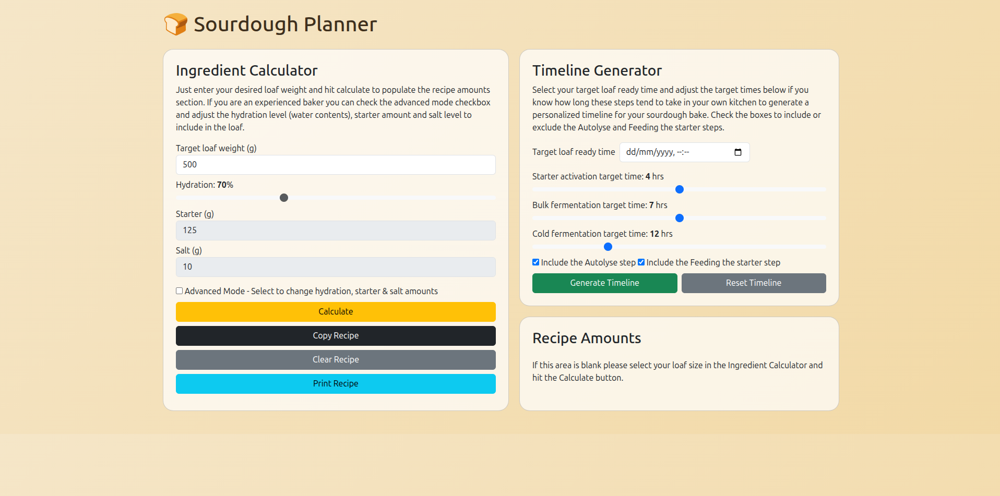
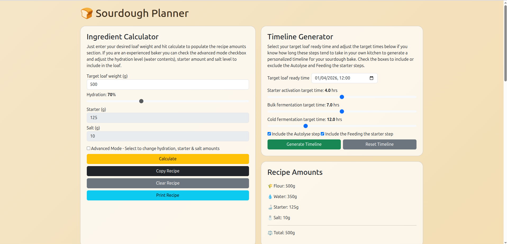
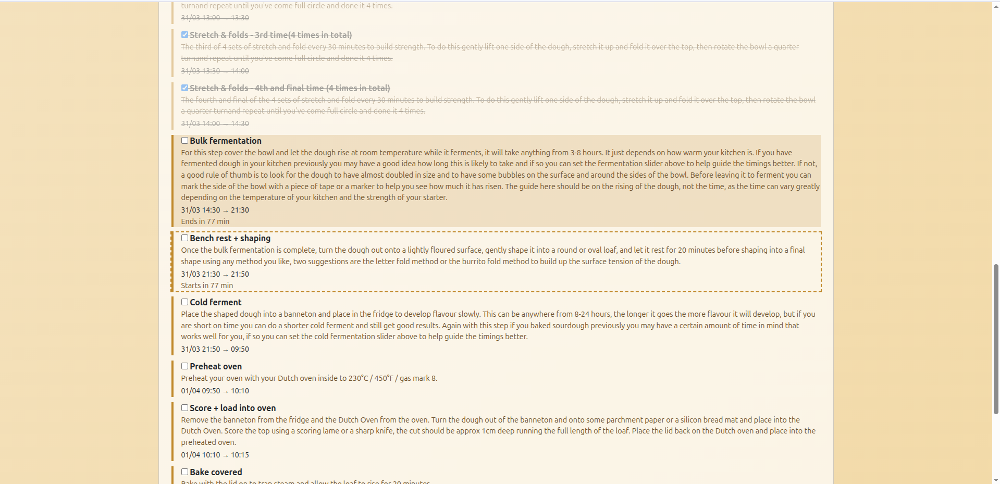
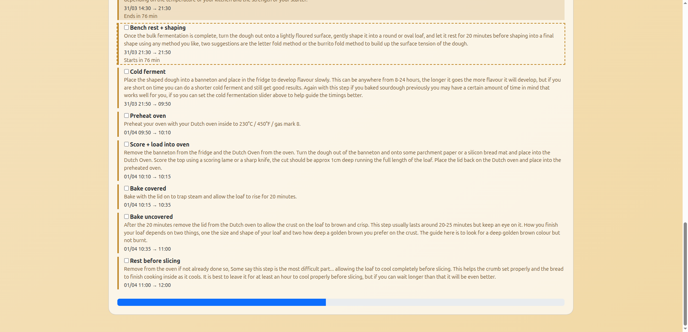

# Sourdough Planner App

Project description:
Sourdough Planner is a simple Flask web app that helps bakers plan a loaf from start to finish. It combines an ingredient calculator with a timeline generator so you can choose a loaf ready time and it will work backwards from your target finish time and organise each stage of the bake for you.

## Features

- Calculate ingredient amounts for a target loaf size
- Simple mode and advanced mode for the calculate ingredient feature - Adjust hydration, starter, and salt values in Advanced Mode
- Generate a baking timeline from a target loaf-ready time
- Customize starter activation, bulk fermentation, and cold fermentation timings if you have a good knowledge of how long these take in your own kitchen
- Optionally include autolyse and feeding the starter steps in the baking timeline
- Tracks progress through the generated timeline including highlighting current and next steps
- Provides a minutes left until next step (in the current step) and a minutes until next step starts (in next step)

## Screenshots

Example 1: App on load


Example 2: App after recipe generation


Example 3: Timeline example image 1 showing past, current and next steps


Example 4: Timeline example image 2 showing additional steps and lower progress bar


## Running Locally

1. Create and activate a virtual environment.
2. Install dependencies using the requirements text file.
3. Run the Flask app.
4. Open the app in your browser.

Example commands:

```bash
python3 -m venv .venv
source .venv/bin/activate
pip install -r requirements.txt
python app.py
```

The app runs locally on `http://127.0.0.1:5001`.

## Running With Docker

Build and run with:

```bash
docker build -t sourdough-planner .
docker run -p 8000:8000 sourdough-planner
```

Then open `http://127.0.0.1:8000`.

## Project Structure

```text
.
├── app.py
├── templates/
│   └── index.html
├── requirements.txt
├── Dockerfile
├── LICENSE
└── README.md
```

## How To Use

1. Select the size of loaf you want to make (unlock advanced mode if experienced baker)
2. Click calculate to display recipe amounts
3. To generate your timeline steps, on the date picker choose a date and time you'd like your loaf to be ready (including tailoring your wait times if you are aware of the temperature affects of your kitchen) and if you want to include the autolyse and starter steps then click generate timeline
4. Timeline steps are displayed below the current sections with checkboxes to mark off as they are completed

## Roadmap

Example ideas to keep, remove, or rewrite:

- Add persistent saved recipes to view across devices
- Add multiple loaf profiles
- Add mobile layout improvements
- Add unit or integration tests

## Issues/Suggestions

Found an issue? Feel free to create a new issue and I'll look into it
Got a suggestion? Again please feel free to open a new issue and make a suggestion, thanks.

## License

This project is licensed under the MIT License. See the `LICENSE` file for details.
